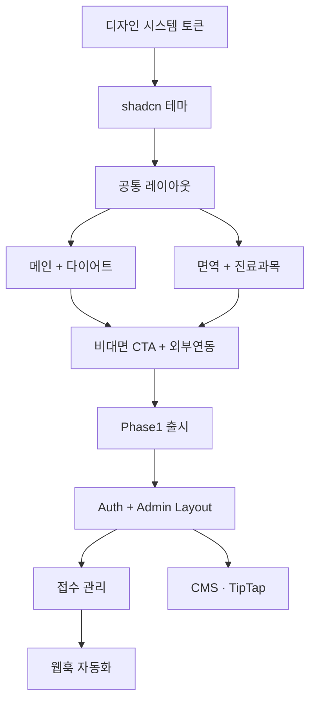

# 부개원 한의원 — 개발 로드맵 & 릴리즈 플랜

> 개발은 클로드 데스크탑 환경에서 진행하며, 본 문서는 작업 순서·의존성·DoD·릴리즈 게이트를 정의한다.
> 일정은 1인 개발(주인) 기준 추정이며, 콘텐츠 작성·이미지 촬영 일정은 별도 트랙.

---

## 0. 트랙 구분

```
T1. 클라이언트(웹앱) 개발
T2. 콘텐츠 (카피·이미지·영상)
T3. 컴플라이언스 (자율심의·동의서)
T4. 외부 채널 (네이버폼·카카오·플레이스·블로그)
T5. 운영(관리자) 시스템
T6. 분석 & 측정
```

---

## 1. Phase 0 — 기획·디자인 (Week 0–1) ◀ 현재

### 산출물
- [x] CLAUDE.md (개발 지침)
- [x] PRD
- [x] 블루프린트 (IA·DB·외부연동)
- [x] 디자인 시스템 마크다운
- [x] 컴플라이언스 & 카피 가이드
- [x] 로드맵 (본 문서)
- [ ] 피그마 디자인 시스템 (변수·컴포넌트)
- [ ] 피그마 페이지 시안
  - 메인
  - 다이어트 허브
  - 한약 상세 표준 (감비환)
  - 면역 한약 허브
  - 한의원 소개 원페이지
  - 비대면 진료 접수 안내

### Definition of Done
- 모든 디자인 토큰이 코드(`tokens.json`)와 피그마(Variables) 양쪽에 정의됨
- 핵심 5개 페이지가 모바일/데스크톱 시안으로 존재
- 콘텐츠 가이드를 따라 한약 상세 1종이 카피 완성본 수준

---

## 2. Phase 1 — MVP 출시 (Week 2–7)

> 목표: 일반 방문자가 사이트를 둘러보고 비대면 진료 접수까지 완주할 수 있다.

### Week 2 — 기반
- 프로젝트 부트스트랩 (Next.js 15 + TS strict + Tailwind v4 + Biome)
- shadcn 설치 + 토큰 적용 (디자인 시스템 매핑)
- 공통 레이아웃 (Header / Footer / FloatingCTA / Layout)
- Supabase 프로젝트 생성, 기본 마이그레이션 (`profiles`, `settings`)
- SEO 기반 (`generateMetadata` helper, `app/sitemap.ts`, `robots.ts`, JSON-LD MedicalClinic)
- Vercel preview 연결, 도메인 임시 연결

### Week 3 — 메인 + 다이어트
- 메인 페이지 (Hero, ProductCards, Sections)
- `/diet` 허브 + ProductCompareTable
- `/diet/gambihwan` 한약 상세 표준 컴포넌트 구현 + 콘텐츠 1차
- `MedicalDisclaimer` 컴포넌트
- 비대면 진료 CTA 다채널(`TelemedicineCTA`)

### Week 4 — 면역 + 진료과목
- `/immune` 허브 + 3 상세
- `/treatments/*` 5 상세
- `/clinic` 원페이지 (앵커 네비, 지도)
- `/telemedicine` 안내 페이지

### Week 5 — 외부 연동 & 분석
- 네이버폼 CTA 통합 + UTM 자동 부착
- 카카오톡 채널 딥링크 + 모바일 fallback
- 네이버 플레이스 지도 임베드, 블로그 RSS 카드
- PostHog + Vercel Analytics + 핵심 이벤트 5종 적재
- 동적 OG 이미지 (`/api/og`)

### Week 6 — 콘텐츠·QA
- 한약/진료과목 카피 최종 (컴플라이언스 통과)
- 한의원 사진 보정·삽입
- 모바일/PC 시각 회귀 (Playwright + Storycap or Chromatic 선택)
- 라이트하우스 ≥ 95 (Performance/A11y/Best/SEO)
- 컴플라이언스 자체 점검 체크리스트 통과

### Week 7 — 출시
- 도메인 확정 (apex + www 리다이렉트)
- 사이트맵 검색엔진 제출 (Naver / Google / Bing)
- 운영자 메일 · Resend 발송 알림 구성
- 출시 회고 + Phase 2 백로그 정리

### Phase 1 출시 게이트
- [ ] LCP < 2.5s (4G 모바일, /, /diet, /diet/gambihwan)
- [ ] CTA 클릭이 PostHog 이벤트로 흐른다
- [ ] 모든 한약 상세에 의무 고지
- [ ] 자체 점검 체크리스트 통과
- [ ] 운영자가 네이버폼 응답을 메일로 받는다

---

## 3. Phase 2 — 운영자 시스템 (Week 8–11)

> 목표: 코드 수정 없이 운영자가 콘텐츠와 접수를 관리할 수 있다.

### Week 8
- Supabase Auth + admin role + middleware 보호
- `/admin` 레이아웃·네비
- 접수 데이터 모델 마이그레이션 (`telemedicine_intakes`, status_log)
- 접수 수기 등록 폼 (네이버폼 응답을 운영자가 옮길 수 있게)

### Week 9
- `/admin/intakes` 리스트(필터·검색·상태) + 상세 drawer
- 상태 변경 로그 + 메모 + 통화 기록
- Realtime 새 접수 알림

### Week 10
- `/admin/products` TipTap 에디터 + 이미지 업로더 + 미리보기
- `/admin/content/banners` 배너 슬롯 관리
- `/admin/content/posts` 자체 블로그 작성/태깅/예약발행

### Week 11
- 네이버폼 → Sheet → `/api/webhooks/naver-form` 자동 적재 파이프라인
- 운영자 메일·카톡 알림 (Resend / 카카오 알림톡 — 검토)
- E2E (Playwright) — 접수 → 상태 변경 → 발송 시뮬레이션

### Phase 2 게이트
- [ ] 운영자가 외부 도구 없이 새 접수→처방→발송 상태를 기록할 수 있다
- [ ] 운영자가 한약 페이지 카피·이미지·배너를 직접 편집한다
- [ ] 자체 블로그 글이 발행되면 sitemap이 갱신된다

---

## 4. Phase 3 — 분석·CRM·성장 (Week 12+)

| 트랙 | 항목 |
|---|---|
| 분석 | 통계 대시보드(채널별 유입·전환·코호트), Funnel 시각화 |
| CRM | 접수 후 N일 재안내, 발송 후 후기 요청 (텍스트만) |
| 자동화 | 카카오 알림톡 (접수확인·발송안내), Resend 시퀀스 |
| 콘텐츠 | 자체 블로그 정기 발행, 키워드 SEO 보강 |
| 부가 | 다국어 (영어), 다크모드(공개), Sentry, 실손 보험 페이지 폼 |

---

## 5. 의존성 그래프



---

## 6. 리스크 & 완화

| 리스크 | 영향 | 완화 |
|---|---|---|
| 네이버폼 자동 적재 어려움 | 운영자 수기 부담 | 초기 수기 + Apps Script POST → webhook 단계적 도입 |
| 의료광고 자율심의 미통과 | 게시 지연 | 카피 가이드 사전 점검, 위험 카피는 처음부터 권장형으로 |
| 사진 자산 부족 | 한의원 페이지 빈약 | 자체 촬영 일정 Week 4 전까지 확보, 임시 일러스트 사용 가능 |
| 1인 개발 일정 압박 | Phase 1 지연 | Phase 1 P0 외 기능은 과감히 Phase 2로 이연 |
| Supabase 한국 리전 외 지연 | 응답 시간 증가 | 정적 페이지(ISR) 비중 최대화, 인증 외 호출 최소화 |

---

## 7. 운영 체크리스트 (출시 전)

- [ ] DNS A/AAAA + Vercel
- [ ] HTTPS 강제 + HSTS
- [ ] robots.txt (`/admin` Disallow)
- [ ] sitemap.xml 생성 & 검색엔진 제출
- [ ] OG 이미지 (메인/한약 상세별 동적)
- [ ] 메타 description 모든 페이지 작성
- [ ] 한의원 정보(주소·전화·시간) 환경변수 / settings 테이블에 1곳에서 관리
- [ ] 개인정보처리방침·이용약관 페이지
- [ ] 푸터 사업자/대표자/면허번호 표기
- [ ] Vercel + Supabase 백업 정책 확인

---

## 8. 산출물 위치

```
/CLAUDE.md
/docs/00-prd.md
/docs/01-blueprint.md
/docs/02-design-system.md
/docs/03-compliance-and-copy.md
/docs/05-roadmap.md      ← 본 문서
/figma/                   (피그마 파일 링크는 README.md 또는 settings에 보관)
/reference/부개원한의원-로고원본.ai
```

---

마지막 업데이트: 2026-04-29
